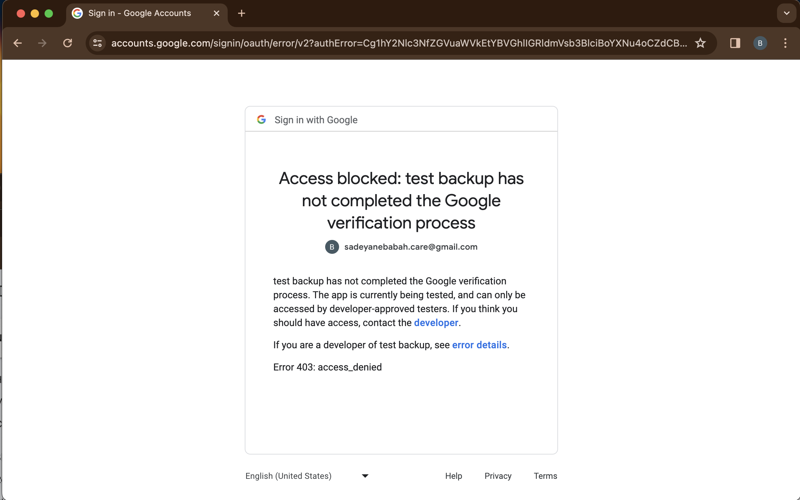

    

# Google Services API oAuth 2.0 Authentication dengan python 2024

Accounts :
- email 	: sadeyanebabah.care@gmail.com
- console 	: https://console.developers.google.com/
- storage	: google drive ( Directories My Drive -> jakarta -> test-drive )
---

Akan melakukan penulisan file pada google drive dengan menggunakan oAuth 2.0 Authentication dari Google Services API.
Berikut tahapan-tahapan yang harus dilakukan :
---

Lakukan akses ke console cloud google.

    

Membuat project.

    

    

    

Enable Google Drive API.

    

    

    

Membuat Credential OAuth 2.0 Client ID.

    

    

    

    

    

    

### rename file credential hasil download tersebut :
    ❯ mv client_secret_1063147155563-pcrdp41ung33243jichsakah34o9b4ml.apps.googleusercontent.com.json client_secrets.json

    ❯ ls -lah | grep client_secrets
    -rw-r--r--   1 powercommerce  staff   407B Feb 18 15:14 client_secrets.json

Dapat dikonfersikan dengan https://jsonprettier.com agar json lebih mudah di baca.

    

    

    

### buat sebuah file yaml bernama settings.yaml dan masukkan dengan format berikut :
Masukkan (copy-paste) client_id dan client_secret berdasarkan informasi dari Client ID for Desktop.

    ❯ vim settings.yaml

        client_config_backend: file
        client_config:
        client_id: 1063147155563-pcrdp41ung33243jichsakah34o9b4ml.apps.googleusercontent.com
        client_secret: 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

        save_credentials: True
        save_credentials_backend: file
        save_credentials_file: credentials.json

        get_refresh_token: True

        oauth_scope:
        - https://www.googleapis.com/auth/drive
        - https://www.googleapis.com/auth/drive.install

Buka dashboard Google Drive pada path My Drive > jakarta > test-drive

    

## Python code

command terminal : 

    ❯ python3 -m venv venv

    ❯ source ./venv/bin/activate

install packages 

    ❯  pip3 install pydrive
    
Buat file main.py dan isi dengan :
- Catatan : values folder adalah base path id address google drive

    main.py :

        from pydrive.auth import GoogleAuth
        from pydrive.drive import GoogleDrive

        settings_path = './settings.yaml' 
        gauth = GoogleAuth(settings_file=settings_path)
        drive = GoogleDrive(gauth)

        folder = "1wFXnCztdnawVpkNc_PWeUYVN97UQCqsI"

        file1 = drive.CreateFile({'parents':[{'id': folder}], 'title': 'bismillah.txt'})
        file1.SetContentString('Assalamualaikum Warahmatullah Wabarakatuh!')

        file1.Upload()

- Struktur files :

    terminal command.

        ❯ tree -L 1 | grep -E ".json|.py|.yaml"
        ├── client_secrets.json
        ├── main.py
        └── settings.yaml

Run python terhadap main.py :

    ❯ python3 main.py

        ~/python-write-file-googledrive-api-oauth-2.0/venv/lib/python3.10/site-packages/oauth2client/_helpers.py:255: UserWarning: Cannot access credentials.json: No such file or directory
        warnings.warn(_MISSING_FILE_MESSAGE.format(filename))
        Your browser has been opened to visit:

            https://accounts.google.com/o/oauth2/auth?client_id=1063147155563-pcrdp41ung33243jichsakah34o9b4ml.apps.googleusercontent.com&redirect_uri=http%3A%2F%2Flocalhost%3A8080%2F&scope=https%3A%2F%2Fwww.googleapis.com%2Fauth%2Fdrive+https%3A%2F%2Fwww.googleapis.com%2Fauth%2Fdrive.install&access_type=offline&response_type=code&approval_prompt=force

akses link yang diberikan dari response main.py

    

    

    

Lanjutkan tahap berikut pada console cloud google.

    

    

    

