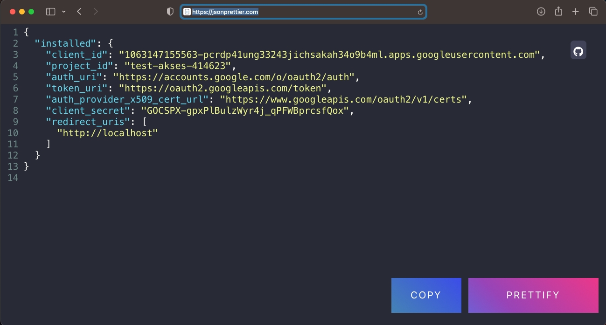

    

# Google Services API oAuth 2.0 Authentication dengan python 2024

Accounts :
- email 	: sadeyanebabah.care@gmail.com
- console 	: https://console.developers.google.com/
- storage	: google drive ( Directories My Drive -> jakarta -> test-drive )
---

Akan melakukan penulisan file pada google drive dengan menggunakan oAuth 2.0 Authentication dari Google Services API.
Berikut tahapan-tahapan yang harus dilakukan :
---

Lakukan akses ke console cloud google.

    

Membuat project.

    

    

    

Enable Google Drive API.

    

    

    

Membuat Credential OAuth 2.0 Client ID.

    

    

    

    

    

    

### rename file credential hasi download tersebut :
    ❯ mv client_secret_1063147155563-pcrdp41ung33243jichsakah34o9b4ml.apps.googleusercontent.com.json client_secrets.json

    ❯ ls -lah | grep client_secrets
    -rw-r--r--   1 powercommerce  staff   407B Feb 18 15:14 client_secrets.json

Dapat dikonfersikan dengan https://jsonprettier.com agar json lebih mudah di baca.

    

    

